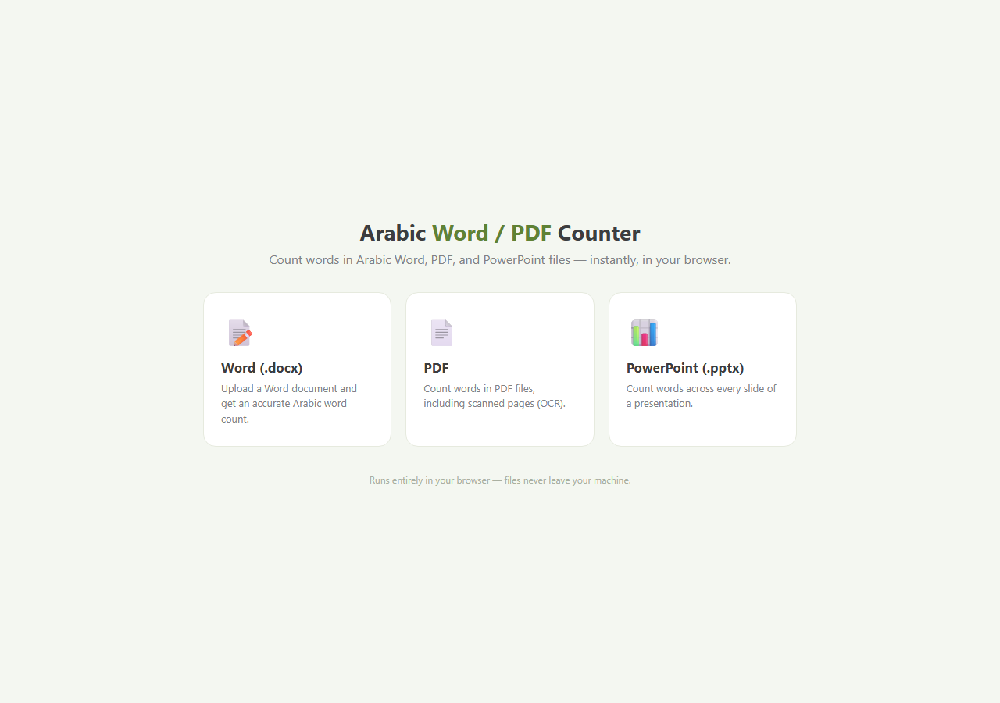

# Arabic Word / PDF Counter

A **pure browser** tool (no server, no install) that counts words in Arabic
**Word (.docx)**, **PDF**, and **PowerPoint (.pptx)** files. Everything runs
client-side — files never leave your machine. Built for a translation office
that needed quick, accurate Arabic word counts for quoting.

## Screenshot



## Features

- **Three counters** — Word, PDF, and PowerPoint.
- **Arabic-aware counting**.
- **100% client-side** — open the HTML, drop a file, get a count. Nothing is
  uploaded anywhere.

## Use it

Just open **`index.html`** in a browser and pick a counter. That's it.

To host it (e.g. GitHub Pages), serve the folder as static files — no build
step. Or run a tiny local server:

```bash
# from the project folder
python -m http.server 8000
# then open http://127.0.0.1:8000
```

> An internet connection is needed the first time only, to load the parsing
> libraries (SheetJS / mammoth / pdf.js) from a CDN.

## Structure

| Path | Role |
|------|------|
| `index.html` | Landing page linking to the three counters. |
| `HTML/` | The three counter pages (Word / PDF / PPTX). |
| `JS/` | Parsing + counting logic for each. |
| `CSS/` | Shared styles. |

## License

MIT
